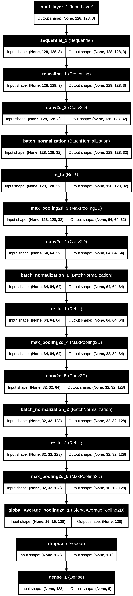
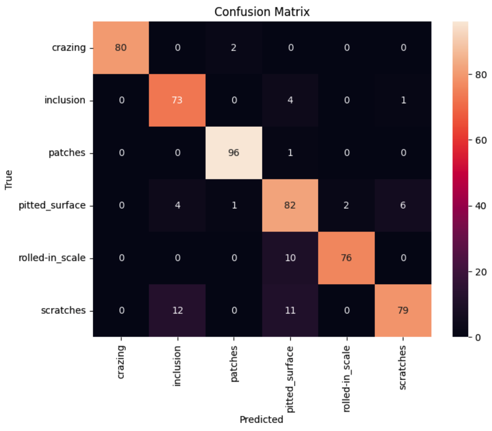
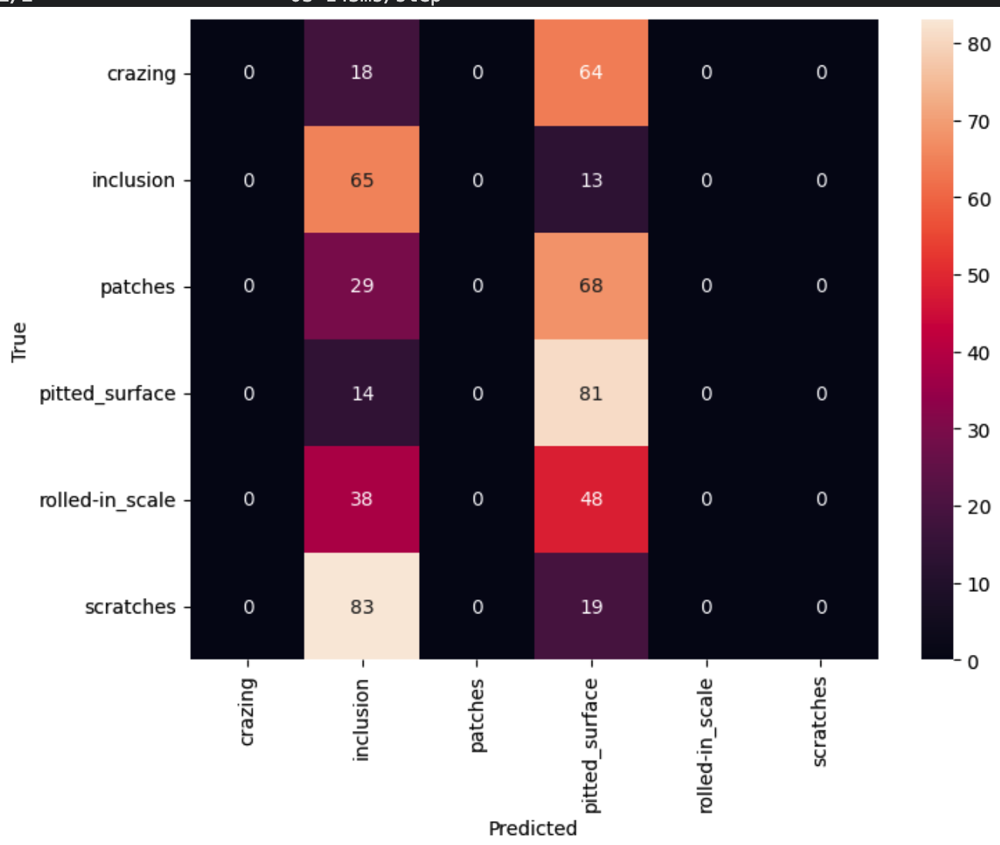
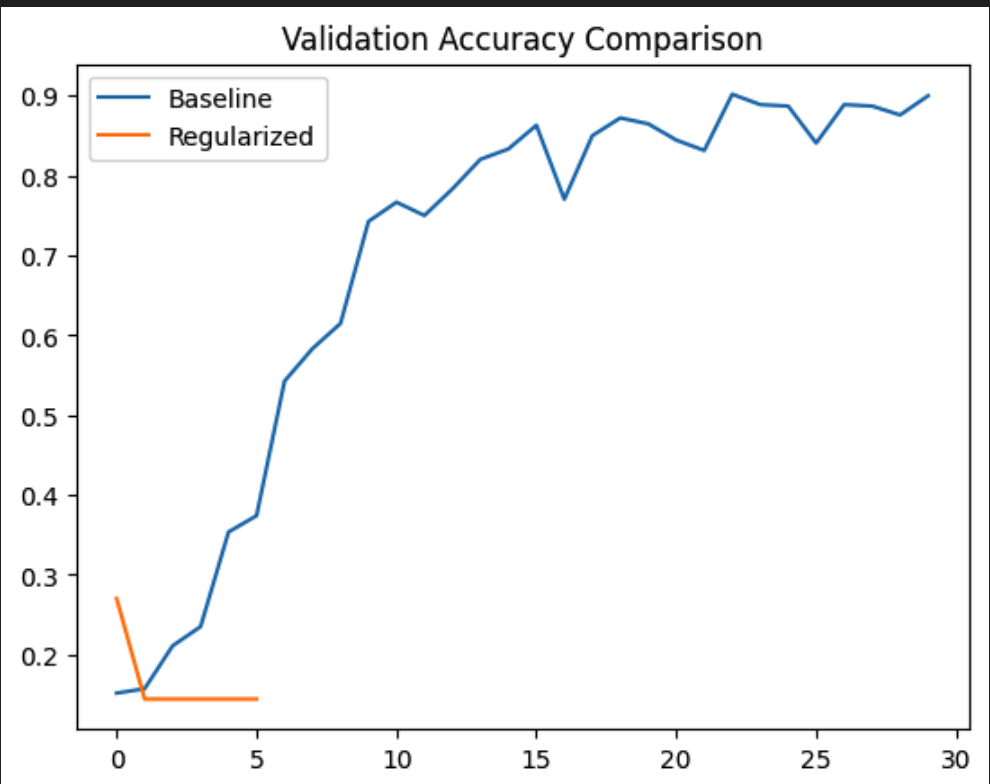
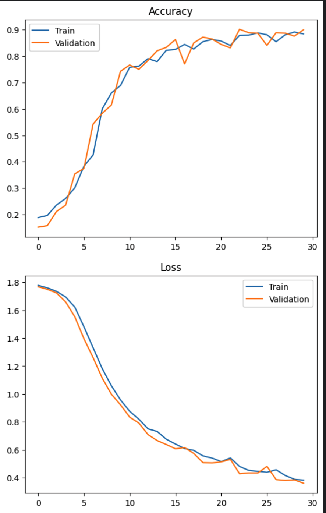
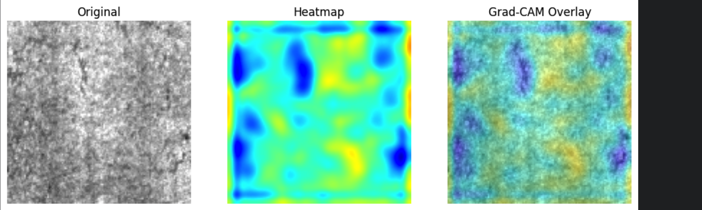

# Steel Surface Defect Classification – Convolutional Neural Network

## 📌 Project Overview

This project implements a **Deep Learning pipeline using Convolutional Neural Networks (CNNs)** to classify steel surface defects from images.

The objective is to automatically detect and categorize different types of surface defects in steel sheets, which is important for **industrial quality inspection and automated manufacturing systems**.

Two CNN architectures were implemented and compared:

- Baseline CNN Model
- Custom Regularized CNN Model

The final system classifies images into **six defect categories**.

---

## 🎯 Problem Statement

Given an image of a steel surface, predict the **type of defect present in the image**.

The model learns spatial patterns and textures from images to detect visual defects automatically.

This is a **multi-class image classification problem**.

---

## 📂 Dataset

This project uses the **NEU Surface Defect Dataset**, a publicly available dataset used for research in industrial surface defect detection.

The dataset contains grayscale images of steel surface defects categorized into six classes.

### Defect Classes

- Crazing
- Inclusion
- Patches
- Pitted Surface
- Rolled-in Scale
- Scratches

### Image Details

- Image size: 200 × 200 pixels (resized to 128 × 128 for training)
- Number of classes: 6
- Each class contains approximately 300 images

### Dataset Download

The dataset can be downloaded from:

https://github.com/abin24/NEU-Surface-Defect-Dataset

After downloading, organize the dataset as follows:

### Image Properties

- Image Size: **128 × 128**
- Number of Classes: **6**
- Images normalized before training

---

## 🔧 Data Preprocessing

The following preprocessing steps were applied:

- Image resizing to **128 × 128**
- Pixel normalization using **Rescaling (1/255)**
- Efficient dataset loading using TensorFlow
- Train–Validation split

---

## 🔄 Data Augmentation

To improve generalization and reduce overfitting, the following augmentation techniques were used:

- Random horizontal flipping
- Random rotation

These transformations allow the model to learn invariant visual features.

---

## 🧠 Model Architecture

The CNN architecture extracts hierarchical image features using convolutional layers followed by pooling layers and dense classification layers.

Key components include:

- Convolution Layers
- Batch Normalization
- ReLU Activation
- MaxPooling Layers
- Global Average Pooling
- Dropout Regularization
- Dense Output Layer

### Model Architecture Diagram



---

## ⚙️ Training Configuration

Optimizer: **Adam**

Learning Rate: **0.0003**

Loss Function: **Sparse Categorical Crossentropy**

Evaluation Metric: **Accuracy**

---

## 🤖 CNN Models Implemented

### Baseline CNN Model

A standard convolutional architecture used as a reference model.

### Custom CNN Model

An improved architecture including:

- Data augmentation
- Batch normalization
- Dropout regularization

These improvements help reduce overfitting and improve generalization.

---

## 📊 Model Evaluation

Model performance was evaluated using:

- Accuracy
- Confusion Matrix
- Training Accuracy Curve
- Loss Curve

### Confusion Matrix – Baseline CNN



### Confusion Matrix – Custom CNN



---

## 📈 Training Performance

### Accuracy Plot



### Loss Curve



---

## 🔍 Model Explainability

Grad-CAM (Gradient-weighted Class Activation Mapping) was used to visualize which regions of the image influenced the model's prediction.

This helps interpret CNN decisions and understand which parts of the image the model focuses on.

### Grad-CAM Visualization



---

## ⚠️ Error Analysis

Misclassified images were analyzed to understand model weaknesses and confusion between visually similar defect classes.

This helps identify:

- visually similar defects
- difficult classification cases
- dataset ambiguities

---

## 📂 Repository Structure

```
ACM-TASKS
│
├── CNN
│   ├── _CNN_.ipynb
│   ├── README.md
│   │
│   └── Images
│        ├── Accuracy_Plot.png
│        ├── Confusion_Matrix_of_Custom_CNN.png
│        ├── Confusion_Matrix_of_baseline_CNN.png
│        ├── Grad_CAM_visualisation.png
│        ├── Loss_Graphs.png
│        └── model_architecture.png
```

---

## 🛠 Requirements

Install dependencies using:

```
pip install -r requirements.txt
```

Main libraries used:

- TensorFlow / Keras
- NumPy
- Matplotlib
- Seaborn
- OpenCV
- Scikit-learn

---

## 🚀 Future Improvements

Possible improvements for this project include:

- Applying transfer learning models such as **ResNet or EfficientNet**
- Increasing dataset size with advanced augmentation
- Hyperparameter tuning
- Deploying the trained model as a real-time inspection system

---

## 👤 Author

**N. Pavan Sai**  
(S4)Artificial Intelligence & Data Science Student
