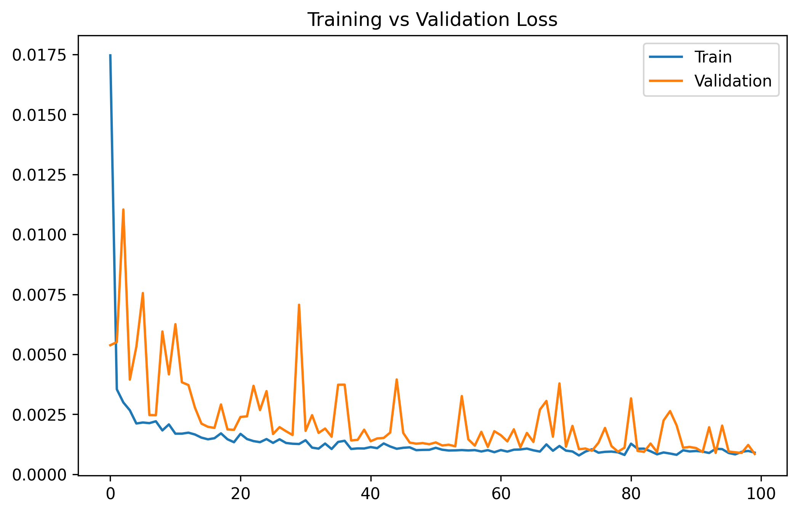
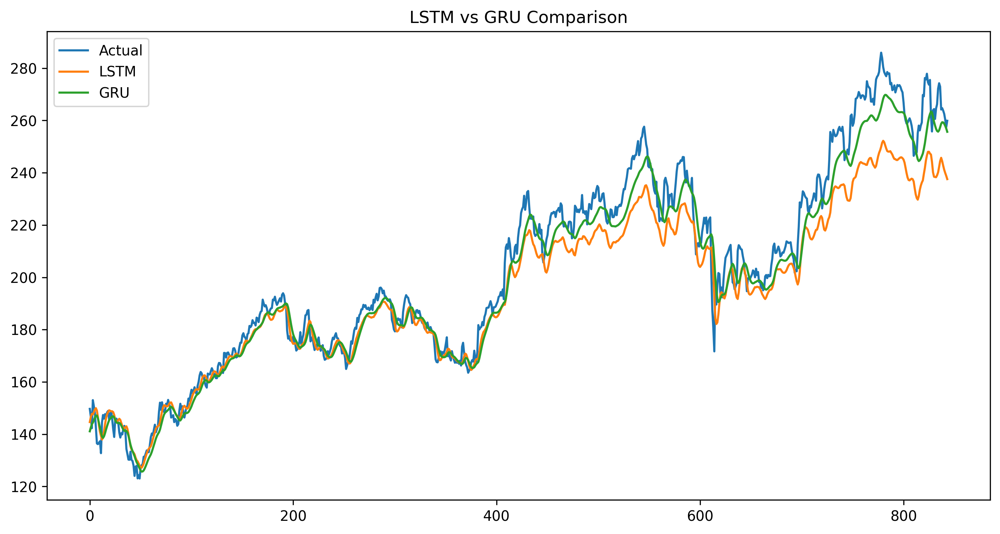
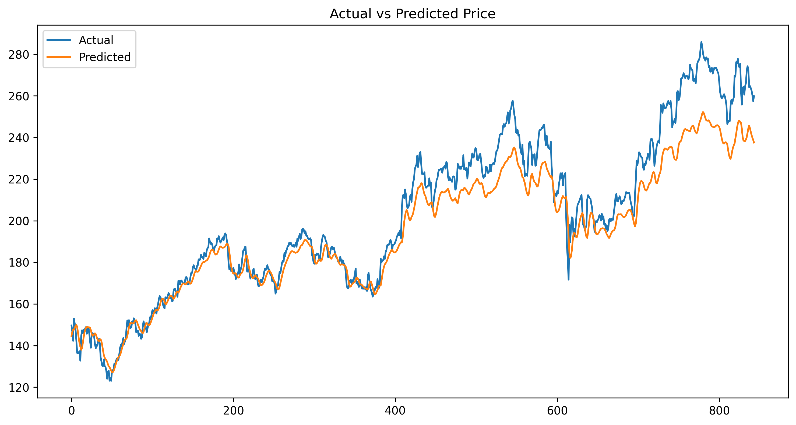
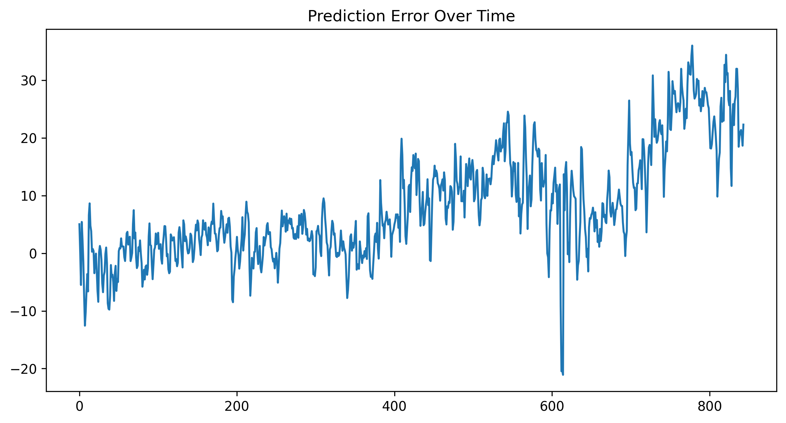

# Stock Price Prediction using LSTM and GRU

## 📌 Project Overview

This project implements a **sequence intelligence system using Recurrent Neural Networks (RNNs)** to predict stock prices from historical time-series data.

The goal is to learn temporal dependencies in financial data and forecast future stock prices using two deep learning architectures:

- **Long Short-Term Memory (LSTM)**
- **Gated Recurrent Unit (GRU)**

The models are trained on historical stock price sequences and evaluated using multiple regression metrics.

---

# 🎯 Problem Statement

Financial markets produce sequential data where current prices depend on past trends.

The objective of this project is to **predict the next closing price using previous price sequences**.

This is formulated as a **time-series regression problem**.

---

# 📂 Dataset

The dataset contains historical stock market data including:

- Date
- Open price
- High price
- Low price
- Close price
- Volume

The **Close price** is used as the prediction target.

---

# 🔧 Data Preprocessing

The following preprocessing steps were applied:

- Sorting the dataset chronologically
- Selecting the **Close price**
- Scaling data using **MinMaxScaler**
- Creating sequential windows for time-series modeling

---

# 🔄 Sequence Windowing

Time-series data is converted into supervised learning sequences using a **sliding window approach**.

Example:

```
Previous 30 days → Predict next day price
```

This allows the neural network to capture temporal patterns.

---

# 🧠 Models Implemented

Two recurrent architectures were implemented.

## 1️⃣ Long Short-Term Memory (LSTM)

LSTM networks capture **long-term dependencies in sequential data**.

Architecture components:

- LSTM layers
- Dropout layers
- Dense output layer

---

## 2️⃣ Gated Recurrent Unit (GRU)

GRU is a simplified version of LSTM with fewer parameters.

Architecture components:

- GRU layers
- Dropout regularization
- Dense output layer

---

# ⚙️ Training Strategy

Training configuration:

Optimizer:

```
Adam
```

Loss Function:

```
Mean Squared Error (MSE)
```

Regularization techniques:

- Dropout layers
- Early stopping

These help prevent **overfitting**.

---

# 📊 Model Evaluation Metrics

The models were evaluated using:

- **MAE (Mean Absolute Error)**
- **MSE (Mean Squared Error)**
- **R² Score**
- **Directional Accuracy**

---

# 🔬 Architecture Comparison: LSTM vs GRU

| Model | MAE | R² Score |
|------|------|------|
| LSTM | 9.25 | 0.895 |
| GRU | 5.86 | 0.961 |

### Observation

The **GRU model achieved lower error and higher R² score**, indicating better performance on this dataset.

---

# 🧪 Ablation Study: Window Size Experiment

Two sequence window sizes were tested to evaluate the effect of historical context.

| Window Size | MAE | R² |
|-------------|------|------|
| 100 Days | 5.84 | 0.960 |
| 30 Days | 5.26 | 0.968 |

### Observation

The **30-day window produced slightly better performance**, suggesting that shorter historical context was sufficient for capturing relevant temporal patterns.

---

# 📈 Training Loss Curve

This graph shows the training and validation loss during model training.



---

# 📊 Model Architecture Comparison

Visualization comparing performance of LSTM and GRU models.



---

# 📉 Prediction Visualization

Actual stock prices vs predicted prices.



---

# ⚠️ Prediction Error Analysis

Error distribution of the model predictions.



---

# 📂 Repository Structure

```
ACM-TASKS
│
├── LSTM
│   ├── LSTM_FINAL.ipynb
│   ├── README.md
│   ├── requirements.txt
│   │
│   └── Images
│        ├── loss_curve.png
│        ├── lstm_vs_gru.png
│        ├── prediction_error.png
│        └── prediction_plot.png
```

---

# 🛠 Requirements

Install dependencies:

```
pip install -r requirements.txt
```

Main libraries:

- TensorFlow / Keras
- NumPy
- Pandas
- Matplotlib
- Scikit-learn

---

# 👤 Author

**Pavan Sai**  
Artificial Intelligence & Data Science Student
